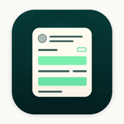

<div align="center">



# PrivyMark

[English](README.md) · **简体中文**

[](LICENSE)
[](https://www.apple.com/ios/)
[](https://ko-fi.com/chen2he)

**分享前，先把隐私盖住。**

</div>

> 一张截图里藏着的，比你以为的多——手机号、卡号、地址、背景里的路人脸。
> PrivyMark 帮你找出来，一键盖住，**全程不出你的 iPhone**，绝不上传。

PrivyMark 在设备本地扫描照片里可能被你不小心分享出去的隐私信息，把每一处识别
结果作为「建议」列给你确认，让你在发布、发消息或转发之前先盖住它们。

<p align="center">
  <a href="https://privymark.o-c.do">privymark.o-c.do</a>
</p>

## 隐私靠架构保证，不靠承诺

- **照片不出设备。** 识别、打码、导出全部在本地完成。打开飞行模式，一切照常工作。
- **什么都不收集。** 无账号、无统计分析、无广告或追踪 SDK，崩溃日志也不含你的
  内容。没有服务器——也就不存在泄露。
- **什么都不保留。** 没有历史记录，不留副本。从分享菜单转交的图片，读取后立即删除。

## 能做什么

- **识别真正要紧的**——人脸、二维码 / 条形码、邮箱、电话、网址、地址、银行卡号
  样式数字、证件 / 护照号（含中国大陆身份证）、订单 / 快递单号、姓名。每一处都是
  可确认的建议，低置信度会标注「可能」。
- **想怎么盖就怎么盖**——色块（不可逆，文字默认）、马赛克、模糊、隐藏文字（融入
  背景色）、手指马克笔，人脸默认用 emoji 覆盖。
- **补扫描漏掉的**——长按一行文字「大爆炸」成词块，只盖要紧的词；或在任意位置画框。
- **顺手清理元数据**——查看文件里的 GPS / 设备 / 时间，默认移除 GPS，可选清除简单的
  像素级隐藏标记。
- **分享菜单直达**——在任意 App 里分享给 PrivyMark，盖好再原路发出去。

### 诚实地说清局限

识别是智能辅助，不是保证——分享前请务必自行确认。文字上的马赛克与模糊在某些情况下
可被还原（所以文字默认用不可逆的色块），隐藏标记清除也无法去除专业级取证水印。
详见应用内说明与[官网](https://privymark.o-c.do)。

## 识别如何工作

100% 本地，跨系统版本渐进增强：

1. **Vision**——人脸框、二维码 / 条形码内容、OCR 文字识别。
2. **规则匹配**（`TextRuleMatcher`）——在 OCR 文本上做关键词 + 正则锚定匹配：电话、
   银行卡（Luhn 校验）、证件号、地址、姓名、订单号等。纯 Foundation，可单元测试。
3. **iOS 26+**——Vision 的 `RecognizeDocumentsRequest` 接管电话 / 邮箱 / 网址 /
   地址 / 快递单号的原生识别与定框；在支持 Apple 智能的硬件上，**端上** Foundation
   Models 语义扫描进一步识别规则漏掉的姓名 / 证件号 / 敏感片段。**只用端上模型**——
   绝不走服务器 / 私有云计算路径。

每一层都容忍下一层不可用，某个识别器失败绝不会卡住编辑器。

## 仓库结构

```
apps/
├── iOS/          # App —— SwiftUI、Vision、Core Image，分享 + 图片编辑扩展、
│   │             #   App Group 交接。iOS 17.6+。
│   └── PrivyMark/
└── web/          # 落地页 —— Next.js + next-intl，经 OpenNext 部署到
                  #   Cloudflare Workers（privymark.o-c.do）。
```

## 构建

**iOS**——用 Xcode（26+）打开 `apps/iOS/PrivyMark.xcodeproj` 运行。图标使用
Icon Composer（`PrivyMark/app.icon`），部署目标 iOS 17.6。

**Web**——

```bash
cd apps/web
pnpm install
pnpm dev        # 本地开发
pnpm build      # 静态构建
pnpm deploy     # OpenNext → Cloudflare Workers
```

## 相关项目

PrivyMark 把一切留在你的设备上；这两个同门项目，把基础设施交回你自己手里：

- **[Orange Cloud](https://o-c.do)**——你的 Cloudflare，一眼看清。iPhone、iPad
  与 Android 原生客户端。
- **[Yield](https://yield.o-c.do)**——自托管的 App Store 订单看板，完全由 Apple
  服务器通知驱动。

## 许可

[MIT](LICENSE) © 2026 JIAMIN CHEN
